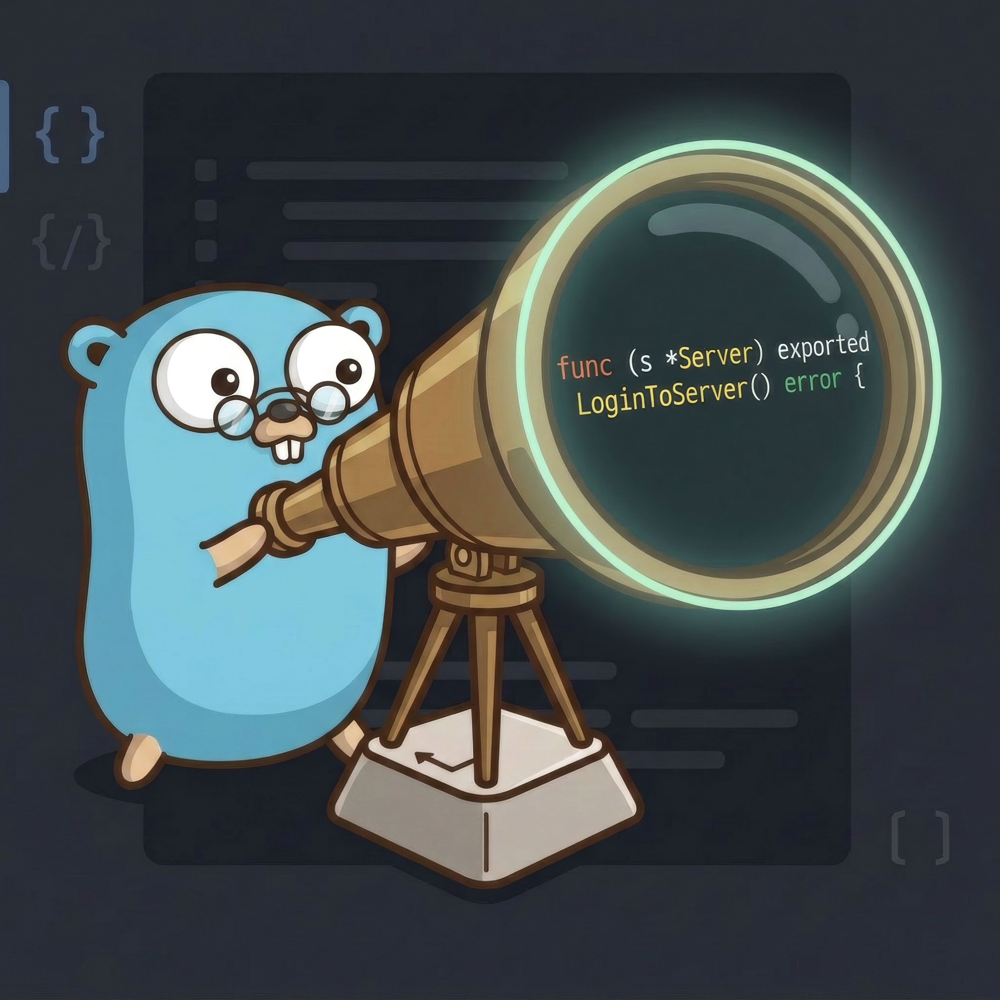
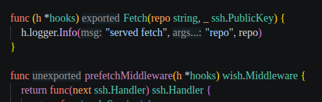

# Scope Gopher

<p align="center">
  
</p>

A VS Code extension that makes Go declaration export status visible at a glance.

[](https://marketplace.visualstudio.com/items?itemName=golang.go)

**Requires the [Go extension](https://marketplace.visualstudio.com/items?itemName=golang.go).**

In Go, uppercase means exported (`LoginToSystem`) and lowercase means unexported (`loginToSystem`). Scope Gopher highlights declaration names in two equal-weight colors so you can tell the difference without scanning case.



## Features

- **Declaration highlighting** — exported and unexported names appear in different colors.
- **Inlay hints** — optionally show `exported` or `unexported` labels before declaration names.
- **Powered by gopls** — uses the official Go extension's document symbols, so markings stay in sync with your code.

Markings apply to declaration names only, not call sites or full signatures.

## Defaults

- Highlighting: **enabled**
- Inlay hints: **disabled**
- Eligible declaration kinds: **functions and methods**

### What gets marked

```go
func LoginToSystem() {}      // marked

func loginToSystem() {}      // marked

func (s *Service) Start() {} // marked (receiver name is not)
```

With inlay hints enabled:

```go
func exported LoginToSystem() {}

func unexported loginToSystem() {}

func (s *Service) exported Start() {}
```

Hints are virtual editor text — they never modify source files.

## Requirements

Requires the [official Go extension](https://marketplace.visualstudio.com/items?itemName=golang.go).

Markings rely on `gopls` document symbols. If symbols are unavailable while `gopls` is starting or indexing, the extension waits quietly until they are ready.

## Extension Settings

| Setting | Description | Default |
|---------|-------------|---------|
| `scopeGopher.highlight.enabled` | Enable declaration highlighting | `true` |
| `scopeGopher.highlight.exportedColor` | Color for exported names | `"#7dd3fc"` |
| `scopeGopher.highlight.unexportedColor` | Color for unexported names | `"#fca5a5"` |
| `scopeGopher.inlayHints.enabled` | Enable inlay hints | `false` |
| `scopeGopher.inlayHints.exportedLabel` | Label for exported hints | `"exported"` |
| `scopeGopher.inlayHints.unexportedLabel` | Label for unexported hints | `"unexported"` |
| `scopeGopher.declarations.enabledKinds` | Which declaration kinds to mark | `["function", "method"]` |

### Supported declaration kinds

The full list of kinds `gopls` can expose:

```json
[
  "function",
  "method",
  "interfaceMethod",
  "struct",
  "interface",
  "type",
  "field",
  "variable",
  "constant"
]
```

Kinds are mapped from `gopls` symbol types. If `gopls` does not distinguish a kind distinctly, it is mapped to the nearest logical enabled kind or skipped.

## What gets marked

- **In scope:** package-level declarations in any Go file where document symbols are available, including tests, generated files, vendor files, dirty buffers, and files outside the workspace.
- **Out of scope:** local variables, constants, parameters, receiver names, labels, and short declarations — anything that cannot be exported from its immediate lexical scope.

Grouped or multi-name declarations are marked per identifier when `gopls` provides unambiguous ranges.

## Identifier support

Targets conventional ASCII Go identifiers. Simple Unicode casing is handled on a best-effort basis.

## Design principle

Export status is neutral. The two highlighting colors carry equal visual weight — neither exported nor unexported is presented as preferable.
